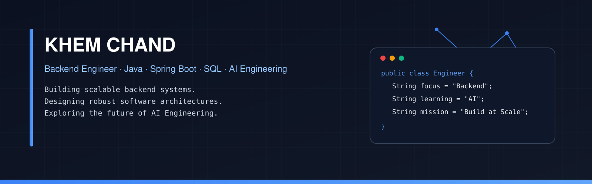
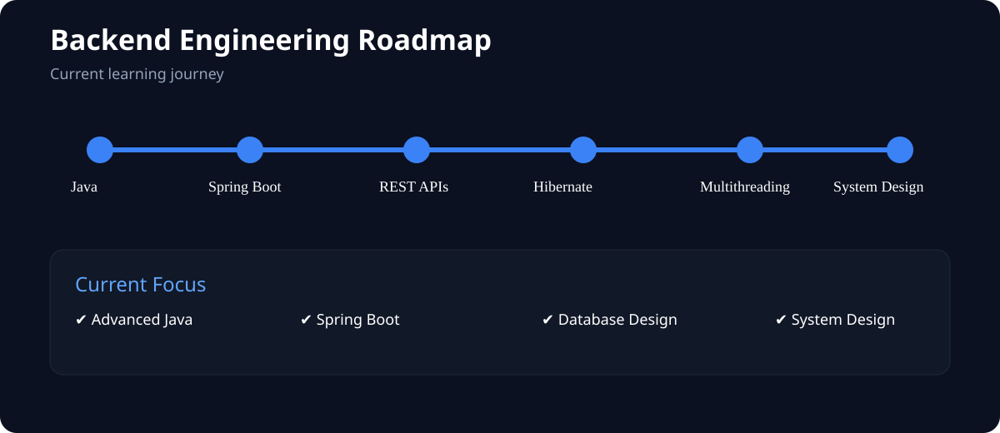
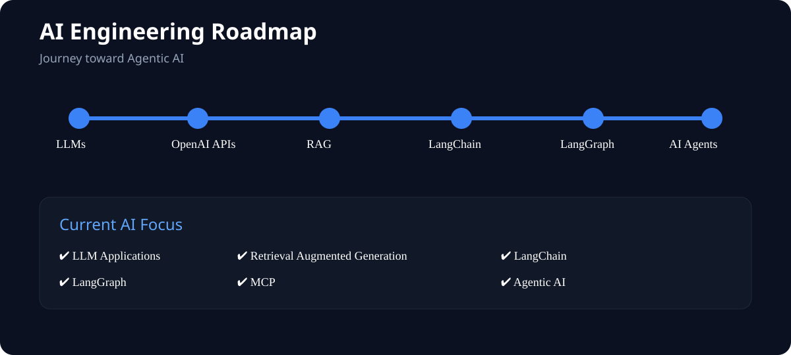

<!-- ========================================================= -->
<!--                 KHEM CHAND GITHUB PROFILE                 -->
<!-- ========================================================= -->

<p align="center">



</p>

<h1 align="center">
Khem Chand
</h1>

<h3 align="center">

Backend Engineer • Java • Spring Boot • SQL • System Design • AI Engineering

</h3>

<p align="center">

Building scalable backend systems today.<br>
Engineering intelligent AI systems tomorrow.

</p>

---

<p align="center">


</p>

---

# Connect

<p align="center">

<a href="https://github.com/Khemchand7">

</a>

<a href="https://www.linkedin.com/in/khem-chand-dev/">

</a>

<a href="https://leetcode.com/u/Khem_chand7/">

</a>

<a href="mailto:khem.chand2516@gmail.com">

</a>

</p>

---

# About Me

```java
public class KhemChand {

    String role =
        "Backend Engineer";

    String currentFocus =
        "Building scalable backend systems";

    String learning =
        "Advanced Java, Spring Boot, System Design, AI Engineering";

    String goal =
        "Backend Engineer specializing in Agentic AI";

}
```

---

# Professional Journey

```text
Accenture
│
├── Oracle → Snowflake Migration
│
├── SQL Validation
│
├── ETL Testing
│
├── IBM DataStage
│
├── Selenium Automation
│
└── Oracle + Snowflake

↓

Scaler Academy

↓

Backend Engineering

↓

AI Engineering

↓

Agentic AI
```

---

# Current Focus

## Backend Engineering

- Advanced Java
- Spring Boot
- REST APIs
- Hibernate
- Design Patterns
- Multithreading
- Concurrency

---

## Database Engineering

- SQL
- Query Optimization
- Database Design
- Indexing
- Transactions

---

## Software Design

- Object Oriented Programming

- Low Level Design

- High Level Design

- System Design

---

## AI Engineering

- LLM Applications

- RAG

- LangChain

- LangGraph

- MCP

- AI Agents

- Agentic AI

- OpenAI APIs

- Vector Databases

---

# Tech Stack

## Languages

<p>


</p>

---

## Backend

<p>


</p>

---

## Databases

<p>


</p>

---

## AI Stack

<p>


</p>

---

## Developer Tools

<p>


</p>

---

# Professional Interests

- Scalable Backend Architecture
- High Performance APIs
- Distributed Systems
- AI Infrastructure
- AI Agents
- Retrieval Augmented Generation
- Developer Productivity
- System Design
- Performance Optimization

---

# Featured Projects

<table>
<tr>

<td width="50%">

## 🍔 Swiggy Clone

Modern food ordering application built using React ecosystem.

### Highlights

- Responsive UI
- Redux Toolkit
- Dynamic Routing
- Restaurant Search
- Cart Management
- Lazy Loading
- API Integration

**Tech**

`React`
`Redux`
`JavaScript`
`TailwindCSS`
`Firebase`

</td>

<td width="50%">

## 🎬 Netflix GPT

Movie recommendation platform powered by LLMs.

### Highlights

- GPT Powered Search
- TMDB Integration
- Authentication
- Multi-language Support
- Personalized Experience

**Tech**

`React`

`OpenAI`

`Firebase`

`Redux`

`TMDB API`

</td>

</tr>
</table>

---

# 🚧 Currently Building

<table>

<tr>

<th>Project</th>

<th>Focus</th>

<th>Status</th>

</tr>

<tr>

<td>Spring Boot REST API</td>

<td>Backend Engineering</td>

<td>🟢 Active</td>

</tr>

<tr>

<td>Parking Lot System</td>

<td>Low Level Design</td>

<td>🟢 Active</td>

</tr>

<tr>

<td>Splitwise Backend</td>

<td>System Design</td>

<td>🟢 Active</td>

</tr>

<tr>

<td>BookMyShow Backend</td>

<td>Scalable Architecture</td>

<td>🟢 Active</td>

</tr>

<tr>

<td>AI Agent Platform</td>

<td>Agentic AI</td>

<td>🟢 Active</td>

</tr>

</table>

---

# 🗺 Learning Roadmap

<p align="center">



</p>

<br>

<p align="center">



</p>

---

# 📈 GitHub Analytics

<p align="center">
  

  
</p>

---

# 🔥 GitHub Streak

<p align="center">


</p>

---

# 📊 Contribution Graph

<p align="center">


</p>

---

# 🏆 GitHub Trophies

<p align="center">


</p>

---

# 🐍 Contribution Snake

<p align="center">


</p>

---

# 👀 Profile Views

<p align="center">


</p>

---

# 💡 Engineering Philosophy

> Build software that scales.
>
> Design systems that last.
>
> Learn continuously.
>
> Automate relentlessly.

---

# 📅 2026 Focus

```text
Backend Engineering
██████████████████████░░░ 90%

System Design
███████████████████░░░░░░ 80%

Spring Boot
████████████████████░░░░░ 85%

Database Engineering
████████████████████░░░░░ 85%

AI Engineering
██████████████░░░░░░░░░░░ 60%

Agentic AI
███████████░░░░░░░░░░░░░░ 50%
```

---

<p align="center">


</p>
